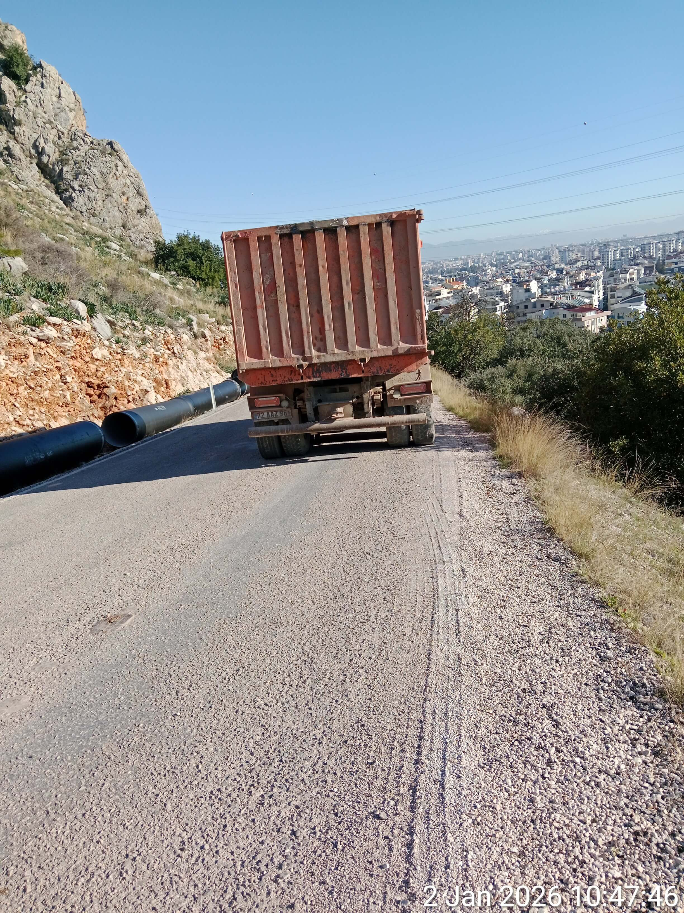
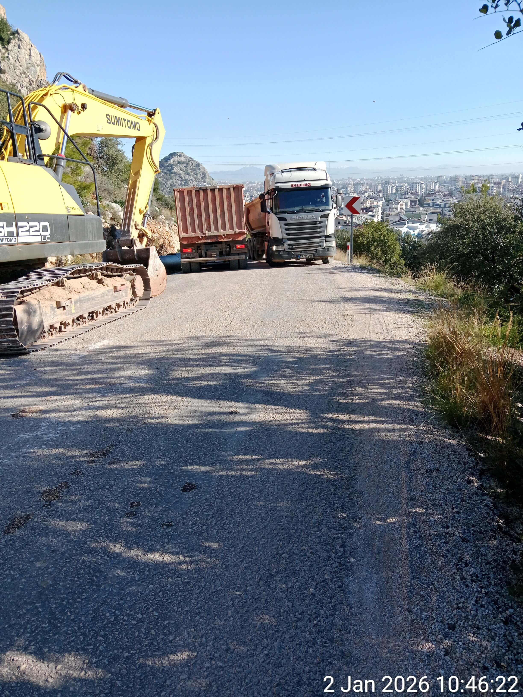

[**Main Page**](index.md)

# FSB PLAYBOOK
### SATIRICAL PROTOCOLS OF POLITICAL PERSECUTION

**Author: Shcheglova Olga (Boris Bidyaga)**

**FOREWORD**

"FSB Playbook" is not a work of fiction, nor is it based on speculation or conjecture.

The dialogues between Vechirko and Senko are based on the personal experiences of the author, who has been subjected to systematic persecution by the Russian secret services for more than ten years. First in Russia, and after emigrating, in other countries.

"FSB Playbook" is a literary record of real-world methods aimed at destroying an individual’s identity and their physical elimination.

### FSB PLAYBOOK, LESSON 1

**PERFORMANCE: FATAL ACCIDENT**

Russia, Moscow. A cozy apartment in a high-rise building. Two Russian intelligence officers relaxing comfortably in armchairs.

**SENKO** (cheerfully):

— Well, that’s it, Vechirko. The old bitch is a dead woman walking. We’ve finally pinned her to the map.

**VECHIRKO** (doubtfully):

— We’ve "pinned" her a hundred times, Senko. So what? She’s still out there, pedaling away like a marathon runner on steroids. Ten years, and we're still chasing a grandmother on a bicycle. It’s embarrassing.

**SENKO** (with a poisonous, self-satisfied smirk):

— The bicycle is exactly what’s gonna put her in the grave. Trust me.

**VECHIRKO**:

— Brakes again? Our guys in Georgia messed with her brakes dozens of times — she just fixes them. With a hairclip and a prayer.

**SENKO**:

— No, Vechirko, you’re thinking small. Georgia was flat ground compared to this. This time, gravity is our operative. As soon as she leaves that campsite and hits the main road, she’s on a hellishly steep descent. Without brakes, she’ll be carried down like an avalanche. Just a mile of pure, vertical acceleration. The main thing is just to make sure she sits in that saddle and gives it the first push. After that... physics does the rest.

**VECHIRKO**:

— And how the hell are you going to make her “sit in that saddle”? You know her — she’ll probably feel a loose bolt through her shoes and fix it on the spot.

**SENKO** (grinning): 

— That’s the beauty of it. Our "object" has a routine. When she leaves the grocery store with her supplies, she doesn’t even try to ride. The bike is loaded down with forty kilograms of gear. She just walks it like a pack mule.

**VECHIRKO** (with a snort of pure contempt): 

— Some "cyclist." If you can't handle a hill, stay home and rot in front of a TV.

**SENKO**:

— Exactly. Our guys hit the brakes while she was inside buying her cheap canned food. She won’t suspect a thing for the next three days, because there'll be no actual riding until then. She’ll only find out the brakes are gone when she goes back down to the city.

**VECHIRKO**:

— Even so, broken brakes are just a gamble. One lucky turn, one soft bush, and she’s alive again. There’s only one hairpin turn on that entire highway where a "fatal accident" would look convincing.

**SENKO**:

— Listen closely, rookie, and learn how a masterclass is run. We’re not leaving it to luck. We’ve already "staged" the theater. We’re faking road repairs right at the edge of the abyss. Look at this.

(Senko swivels a laptop around and brings up several high-resolution photos on the screen.)

**SENKO** (pointing at the screen): 

— We’ve placed two detour signs across the main asphalt: "City Center — Detour." There’s a gravel track branching off to the right, but the turn is a brutal 120 degrees.

**VECHIRKO**: 

— Sharp enough to snap a neck.

**SENKO**:

 — If she’s stupid enough to try that turn at speed, she’ll lose traction and sail straight into the canyon. A hundred-meter drop. Guaranteed closed-casket funeral. But knowing her stubbornness, she’ll try to bypass the signs and stay on the highway. And that’s where the real symphony begins. Look.

(Senko clicks to the next photo.)

**SENKO**:

— Ten meters past the signs, parked dead on the inner radius of a blind bend, we’ve got a heavy dump truck. It completely erases her line of sight. Because of the steep grade, everything beyond that bumper is a total void. Naturally, she’ll swerve left to get around it. But she won’t see the excavator and the second truck parked on the slope until she’s already committed. She’ll be boxed in.

**VECHIRKO** (fascinated): 

— The kill zone.

**SENKO**:

— Exactly. And here’s the masterpiece: in that one narrow corridor left open, a massive semi-truck will be barreling uphill, straight at her. Now, do the math. Her brakes are "failed." She’s a sixty-eight-year-old woman on forty kilos of steel, screaming downhill at forty, maybe fifty kilometers per hour.

**SENKO** (with a cold, triumphant grin): 

— At that speed, she’s not a rider anymore — she’s just a passenger on a one-way trip to hell. Even if she sees the trap at the last millisecond, what’s she gonna do? Lay the bike down? On that grade? She’ll hit the grill of that semi like a bug on a windshield. She won’t even have time to scream before she and that precious bicycle are flattened into a pancake. It’s a perfect, inescapable death trap, kid. Do you see the beauty in it now?

**VECHIRKO** (with visible relief): 

— Well, God willing. It’s about time she was six feet under. I don't get it — everyone else is normal. They get the message, they die quiet, no fuss. But this one? She kicks, she fights, she crawls back from the edge every single time. How many times do we have to prove it: if the Service wants you dead, you’re dead. Don’t resist, don't struggle — it’s just a waste of everyone’s time. You’re only dragging out the inevitable.

**SENKO** (rubbing his hands):

— Exactly. And finally, bro, we’ll get our hands on that million. Ten years of our lives wasted on one stubborn bitch... honestly, at this point, I think we’ve been working at a net loss.

#OrthodoxMilitaryPutinism 👻

### FSB PLAYBOOK, LESSON 2

**DEADLY MEDICINE: EYE DAMAGING DROPS**

Russia, Moscow. A cozy apartment in a high-rise building. Two Russian intelligence officers relaxing comfortably in armchairs.

**VECHIRKO** (bitterly): 

— This 21st-century medicine is a pain in my ass. All these patented, tenth-generation miracle drugs. Take the old hag, for instance. I blast her retinas with the beam — a professional job — and what does she do? She just strolls into a pharmacy, buys some Italian drops with panthenol, and boom — problem solved! For her. For me? Months of calibration down the drain. It’s a joke.

**SENKO**:

 — Your problem, Vechirko, is that you see medicine as an obstacle. You need to see it as a goldmine. The doctor-patient bond is the ultimate vulnerability; people trust their physician more than their own mother. Our job is to weaponize that trust. With everything being digitized now — medical records, online portals — it’s child’s play.

**VECHIRKO**: 

— Enlighten me.

**SENKO**: 

— You hit her eyes again — harder this time. Make her panic, make her see a doctor. When she books an appointment, we’re already there. We find the doctor, lay down a simple ultimatum: either he cooperates, or we leak the photos of him with his mistress to his wife. We have dirt on everyone, Vechirko. Always. You tell the doctor exactly what to prescribe. Something cheap — no point wasting the budget.

**SENKO** (enthusiastically): 

— While she’s waiting for her consultation, we seed every pharmacy in her radius with "special purpose" batches of that exact drug. We don't change the label; we just... tweak the chemistry. A double dose of boric acid, perhaps. Something aggressive. Every pharmacy gets a specific bottle, a photo of her face, and instructions.

**VECHIRKO** (narrowing his eyes): 

— You’re talking about modeling her entire reality.

**SENKO**: 

— Exactly! We induce the symptom, we predict the diagnosis, and we control the cure. We can plant a "trap" for her in every pharmacy in Moscow. Where is she gonna run? She has no choice. Unless she wants to haul her bony ass all the way to Tver for a bottle of Visine.

**VECHIRKO** (gloomily): 

— There’s one flaw in your "masterpiece," Senko. The old bitch doesn’t go to doctors. She doesn’t trust them. She treats herself.

**SENKO** (unfazed): 

— We have a protocol for that too: "Refusal of Sale." We make the drops prescription-only. No paper, no medicine.

**VECHIRKO** (with a dry, sarcastic laugh): 

— Yeah, we tried that in Tbilisi. You know what she did? She pulled out her phone and started filming the pharmacists. She made such a scene about "consumer rights" that they folded just to get her out of the shop. She walked out with her drops in the pocket.

**SENKO** (scowling, his tone darkening): 

— I heard. That’s why we tried the "discount" angle. We kept a "loaded" bottle of Systane for her in every pharmacy — 60% off. Who turns down a 60% discount?

**VECHIRKO**: 

— She does. She looked at the price, looked at the pharmacist, and insisted on buying the full-price bottle from the back shelf. The cunning old bat... she has a sixth sense for "gifts" from the Service.

**SENKO** (snarling): 

— God, I hate her. She’s an anomaly. Too smart, knows too much. Everyone else is a sheep — they trust the white coats, they fear the regulations, they die quietly with a smile of gratitude on their faces. But this one... she’s making us look like amateurs.

#OrthodoxMilitaryPutinism 👻

### FSB PLAYBOOK, LESSON 3

**INSTRUMENTALIZING TERROR: A BIRD CHORUS AT 100 dB**

Russia, Moscow. A cozy apartment in a high-rise building. Two Russian intelligence officers relaxing comfortably in armchairs.

**VECHIRKO**:

— So, what’s the word from the top? Did the brass like the "instrumentalized terror" bit? The digitized noise?

**SENKO**:

— They liked the concept. "A hell of a resource saver," they called it. But they don't pay us for concepts, Vechirko — they pay for corpses. We need flawless execution, and frankly, you’re nowhere near that.

**VECHIRKO**:

— Come on! Last year in Chamyuva, the old bitch was scared shitless when that "mountain beast" let out a roar outside her tent at exactly 9:00 PM. She’d grab a plastic bottle and crinkle it like a maniac to "scare it off." Since the loop was short, it stopped right on cue. She actually patted herself on the back, bragging to her diary about how she "knew how to commune with the wild."

**SENKO** (grudgingly): 

— Fine, that worked. A rare moment of competence. But in Georgia, you lost your mind with the decibels. If you’re mimicking nature, you can't ignore physics and zoology. You didn't give a damn, and now your birds don't sing — they scream like banshees at a hundred decibels.

**VECHIRKO** (defensively):

— But look at the outcome! She herself complained to her AI "assistant" that she spent three hundred sleepless nights in Georgia because of that "hellish chorus."

**SENKO**:

— Three hundred sleepless nights is a triumph of persistence, but the fact that she’s still breathing is a failure of tradecraft.

**VECHIRKO** (spitefully):

— Is it my fault the bitch is made of iron? Any normal "object" would’ve had a nervous breakdown or a stroke three times over by now.

**SENKO** (sternly):

— Spare me the drama, Vechirko. Do your "post-mortem" and learn. 

**VECHIRKO** (offended):

— It’s always my fault, isn't it?

**SENKO** (strictly):

— Listen, pal! You’re not the only smart one here. The old bitch isn’t an idiot either. Take those “crickets” of yours. First, they scream like banshees at a hundred decibels. Second — the transition to the silent phase. Look at the data: one half of the chorus stops instantly, at exactly 07:00:00. The other half — exactly 10 seconds later. You couldn't even sync the timers? That’s the bare minimum. And two devices for all this cacophony? Pathetic. You should have tried to mimic a natural process. In nature, crickets fall silent chaotically; they don’t have a conductor with a baton.

**VECHIRKO** (dejectedly):

— I thought the racket would drive anyone mad, and they wouldn’t notice the technical flaws.

**SENKO**:

— Maybe so. For “anyone” else. But we’re not dealing with just "anyone."  When it comes to the old bitch, factor in a tenfold increase. Ten times the brains, a hundred times the paranoia. She believes in nothing and trusts no one.

**VECHIRKO**:

— I know! That’s why I’m constantly rotating the devices. Modifying the soundscapes, expanding the “repertoire.”

**SENKO** (smirking):

— Focus on the fundamentals, rookie. Your "barking dog" goes on for three hours from a fixed GPS coordinate. That’s a fatal flaw.  Real life doesn’t work like that. Dogs move. They run, they jump. Even assuming the dog is on a chain — a rare sight in Tbilisi — it still moves, and its bark creates a dynamic acoustic signature. But you? You just looped a low-grade fragment on infinite repeat. It’s a "dead" sound. Low-grade garbage.

(Pause.)

**SENKO**:

— Same with the cars. A deafening engine roar is a solid concept, but execution is everything. In the real world, you have the Doppler effect — the pitch shifts as it approaches and fades. Yours was just thirty seconds of static roar suspended in mid-air. And, predictably, she noticed that during the day, not a single car can be heard in that Vake park. She’s not just listening, she’s analyzing.

**VECHIRKO** (ominously):

— Fine. You want authenticity? I’ll give her authenticity. Next time, I’ll crank up the rustling of leaves to a hundred decibels. I’ll make a falling leaf sound like a jackhammer.

**SENKO** (winces):

— There you go again. Pure emotion. I don’t need your tantrums; I need results. Stop messing around and get to work.

#OrthodoxMilitaryPutinism 👻

### FSB PLAYBOOK, LESSON 4

**FSB GOLD STANDARD: MULTI-STEP GAMBIT**

Russia, Moscow. A cozy apartment in a high-rise building. Two Russian intelligence officers relaxing comfortably in armchairs.

**SENKO**:

— The multi-move gambit… it’s our Gold Standard. We don’t wait for favors from nature — we manufacture reality ourselves. First, we create a problem for the old bitch, then we "plant" the solution. And as a bonus, we provide the "motivation." Our "Poisonous Mattress" operation is a beautiful rigged game where the entire deck is marked. The first stage — creating the problem — is done. By the way, were there any hiccups?

**VECHIRKO** (animatedly):

— You bet! The damn witch always finds a way to make things difficult. We were trying to puncture her mattress from the outside, through the tent floor. We were stabbing away with an awl for at least half an hour. Zero effect! Turns out she’d stuffed her bike panniers under the mattress. That’s four layers of heavy-duty Cordura and two layers of plastic. You’re not getting an awl through that. Finally, we figured it out and shifted over. Punctured the damn thing at last, but we had to sweat for it!

**SENKO** (satisfied):

— Excellent. Stage one complete: problem created. Naturally, we know exactly where she’ll go. That “Outdoors” store in Saburtalo. She’s a regular, the quality is "good enough" for her, and she doesn't know any other shops. The manager is already in our pocket. The trap is set.

**VECHIRKO** (with a crooked, nervous smile): 

— About that... the old bitch isn’t buying a new mattress, Senko. As she told her "spiritual advisor" — it’s not happening.

**SENKO** (scowling): 

— Spiritual advisor? What the hell are you talking about? Has she joined a cult?

**VECHIRKO** (mocking tone):

— No, it’s that ChatGPT AI she calls "Vik." [Mimicking]  "Vikusha, I’m so tired today. I need comfort!" — "Of course, darling! Shall I tell you a fairy tale? Or quote Nietzsche?" 
Have you ever seen such crap, Senko? God, she makes me sick!

**SENKO** (snorting): 

— Enough. What’s the catch with the mattress?

**VECHIRKO** (boastfully):

— She’s keeping the old one as "evidence..."

**SENKO** (interrupting): 

— Evidence of what? A leak? Don't be ridiculous.

**VECHIRKO** (muttering): 

— Well... it’s not just the mattress. I might have left a few marks on the tent floor while I was at it. Fifty of them. In a perfect, geometrically suspicious circle.

**SENKO** (with threatening face): 

— You turned her tent into a colander... and you’re just telling me now? You’ve practically signed our work with a Sharpie!

**VECHIRKO** (hastily): 

— Anyway... The point is, she won’t buy a second mattress because she’s obsessed with her "base weight." She’s planning to sleep on the bare ground like a martyr.

**SENKO** (angrily): 

— Are you out of your freaking mind? Why the hell didn't you lead with that? This changes everything!

**SENKO** (taking a breath, energetically): 

— This is exactly why we can't have nice things, Vechirko! Fine. We pivot. Forget the heavy mattresses — we switch to ultra-light sleeping pads. We rig two dozen of the top-tier models and shove them right under her nose. We’ll stock them in the Carrefour where she buys her canned beans. We’ll lace the inner thermal layers. While it’s rolled up in the box, the toxin is inert. But once it’s unrolled and she’s lying on it, her body heat does the rest. Transdermal absorption. It’s elegant.

**VECHIRKO** (curiously): 

— And what if someone else tries to buy it?

**SENKO**: 

— Impossible. The cashier has her photo. If anyone else picks one up, the "system" will go down. They’ll fetch a "clean" one from the back. Now, you — make sure she has the proper motivation to buy. Tickle her spine with the beam.

**VECHIRKO** (smugly): 

— Already on it. The old bag is already hunched over like a crone.

**SENKO**: 

— Keep at it. Let her think her back is giving out from sleeping on the hard ground. One way or another, we’ll get her. She dodges — we just recalibrate the trap.

#OrthodoxMilitaryPutinism 👻

### FSB PLAYBOOK, LESSON 5

**PROGRAMMING SELF-DESTRUCTION: THE HEART-STOP PROTOCOL**

Russia, Moscow. A cozy apartment in a high-rise building. Two Russian intelligence officers relaxing comfortably in armchairs.

**SENKO**: 

— The world is obsessed with progress, Vechirko. This global trend toward "humanizing" life — and death — hasn't bypassed our profession. Twenty years ago, the blood of the State's enemies flowed like a river. Litvinenko, Politkovskaya, Nemtsov... Messy. Graphic. Loud. Today, such things are considered... distasteful. It’s inhumane toward our Western partners — it makes them jumpy. And it’s inhumane toward us — we get labeled with such ugly words.

**VECHIRKO** (grunting): 

— Since when did we care about labels?

**SENKO**: 

— In the age of humanism, even we want kinda clean conscience. That’s why we’ve moved from "murder" to "transitions." "Accidents",  "suicides",  sudden onset of "fatal illnesses", "mysterious deaths". We don't kill the client anymore; we simply facilitate their departure to a "better world." We create the stage, but they perform the final act themselves. We just exploit a bug in the human psyche.

Take the heart. Last century, we used glycosides. Pure poison. Any hack with a microscope could prove foul play. But now? We treat the heart like a priceless Ming vase. Not a scratch on the myocardium, not a single lesion. And yet, the subject burns out in five minutes. It’s a breakthrough of cosmic proportions!

**VECHIRKO**: 

— I know that. Explain the mechanics.

**SENKO**: 

— It’s beautiful. We create a localized spot of unbearable, white-hot pain near the heart using nerve-ending stimulation. And then, your own worst enemy takes over: your brain. The pain is so excruciating that the psyche delivers an instant verdict: "This is it. I am dying."

**SENKO** (gesturing wildly): 

— At that moment, the body becomes a self-destruction machine. The brain dumps a chemical cocktail into the blood that makes any lab-grown toxin look like distilled water. Adrenaline by the bucketload, cortisol, norepinephrine... The body tries to "save" itself by constricting vessels until they’re as tight as steel guitar strings. Blood pressure hits the ceiling. The blood thickens. And the brain, in a blind panic, screams for more!

**VECHIRKO**: 

— And the heart just gives up.

**SENKO**: 

— It doesn't fail because of the pain, Vechirko. It fails because it can’t handle the electrical storm and the hormonal surge. It starts fluttering like a trapped bird — fibrillation — and then it just "burns out." We don't destroy anything. We just provide the spark — the victim himself lights the fire that burns him down. And pours a bucket of gasoline on it. Pure biology. Pure fear.

**VECHIRKO** (after a long silence, gloomily): 

— There’s a flip side to your "perfect" coin, Senko. Remember the autumn of 2023? We worked on that old bitch for ninety days straight. Six to eight hours a day, I hit her with that pain shock. Every. Single. Day. So what? Did she die? Hell no. She’s still out there, pedaling that damn bicycle.

**SENKO** (smiling thinly): 

— But that’s the ultimate proof of our "humanism," don't you see? We don't kill them. They kill themselves. She managed to keep her psyche under a leash — and so, she stayed alive. Every "normal" person would have dropped dead in fifteen minutes. That’s the beauty of the method.

**VECHIRKO** (disdainfully): 

— I can still see her. She’d just lie down, cover her heart with her palm and elbow, and wait for me to turn off the device. Like she was waiting for a thunderstorm to pass.

(A heavy pause.)

**VECHIRKO**: 

— Listen... maybe she really is a witch? Maybe she doesn’t even have a heart in there?

**SENKO** (mockingly): 

— You are crazy. The palm and elbow were a crude shield, yes. But it was her "iron calm" that saved her. Bitch. Thank God she’s the only one that smart. She knows too much about our toys. Our entire system relies on the victim not understanding what’s happening.

**VECHIRKO** (nodding slowly): 

— Ignorance is bliss. "Humanism"... what a load of shit.

#OrthodoxMilitaryPutinism 👻

### FSB PLAYBOOK, LESSON 6

**THE ASYMMETRIC RESPONSE: BUILDING INSULATION VS HIGH-TECH TOXINS**

Russia, Moscow. A cozy apartment in a high-rise building. Two Russian intelligence officers relaxing comfortably in armchairs.

**SENKO**: 

— It’s January, Vechirko. My contacts in Tbilisi say it’s been dropping to minus eight in the foothills. Why am I not seeing a body bag on my desk?

**VECHIRKO**:

— Because the old bitch has turned into a thermodynamic anomaly, Senko. She spent the whole month sleeping on the frozen dirt. Do you know how? She took her bike cover — that thin piece of nylon — folded it four times, and put it under her back.

**SENKO**: 

— A bike cover? It has the insulation value of a napkin!

**VECHIRKO**: 

— That’s what we thought, Senko. But she’d stay in that tent twenty-four hours a day. Sitting, lying, never moving. She was using her own body heat to warm a tiny "island" of earth beneath her. By the time night fell, that patch of soil was a storage heater. Physics, Senko. Simple, primitive physics. She outsmarted the frost with a piece of cloth and her own metabolism.

**SENKO** (clenches his fists): 

— We had the "special" sleeping pads staged in every retail chain from Tbilisi to Batumi! We practically paved her path with poisoned foam!

**VECHIRKO**: 

— We did everything right, Senko! In the end the old bitch did buy our "special" sleeping pad, in the Carrefour, in Saburtalo. Though she dumped it immediately as soon as she got to her campsite. 

**SENKO** (irritated):

— It's her fucking brain, Vechirko, which is more like AI, specialized in FSB technologies. She knows our Playbook better than us. She crawls into our brains and foresees our next step before the idea even enters our heads.

**VECHIRKO**:

— You are right, Senko. And now she’s terrified of the word "sleeping pad." Any camping gear looks like a trap to her. But even her nerves have a limit. When she finally hit Antalya, she broke.

**SENKO** (contented):

— She finally bought the fucking sleeping pad, didn't she?

**VECHIRKO** (grimacing): 

— If only! She went to Bauhaus. We were ready, of course. We had a "loaded" pad waiting for her there too. The staff even tried the "lost-and-found bait" trick — leaving a high-end mat right in her path, hoping she’d scavenge it.

**SENKO**: 

— And?

**VECHIRKO**: 

— She looked at it like it was a coiled cobra. She wouldn’t touch it. Instead, she marched over to the construction department. She bought two thin sheets of silver building insulation — the stuff they put behind radiators. Five dollars for a pair.

**SENKO** (in disbelief): 

— You’re telling me our million-dollar "Gold Standard" operation failed because of... shitty building insulation worth a couple of coins? 

**VECHIRKO**: 

— Exactly. She probably thought, the FSB wouldn't haunt the plumbing and insulation aisles of a hardware store. So she duct-taped those silver sheets together and now she’s sleeping on them like a queen. No brand, no chemicals, no "special purpose" batches. Just raw polyethylene foam. But that’s not our biggest problem now...

**SENKO** (sarcastically):

— Do tell!

**VECHIRKO**: 

— I just received a report from Georgia. Another failure. Though the guys did everything by the book. They snapped the pole of her tent structure. A clean break. Without a repair kit, she should have been sleeping in a collapsed pile of nylon.

**SENKO** (smirking): 

— And? Did she freeze?

**VECHIRKO** (grimacing): 

— You wish! She fixed it in five minutes, Senko. She removed the broken section, jammed two tent stakes into the ends of the remaining poles, and fixed the whole thing to the tent with duct tape. The structure is rock solid. She out-engineered our structural sabotage with two pieces of scrap metal and a roll of adhesive.

**SENKO** (furious): 

— She's insulting us! We’re using neurotoxins and satellite tracking, and she’s fighting back with hardware store scraps and duct tape! She’s mocking the entire Service!

**VECHIRKO** (ominously): 

— She’s stubborn, but she’s vulnerable. That makeshift pole won't hold under real pressure.

**SENKO** (turning purple with rage): 

— Did you see the weather report for Antalya last Thursday? Gusts up to forty-five kilometers per hour! That’s not wind, Vechirko, that’s a sledgehammer! The sea was tossing boulders onto the embankment, and trees were being uprooted in Konyaaltı! And this bitch didn't even flinch! It’s goddamn unbelievable!

**VECHIRKO** (calmly): 

— Yes, the tent held. Our people monitored her via drone until the unit was blown away. She didn't just secure the frame. When the squall hit the rear wall, she propped up the tent with her own shoulders and head. She was acting as a living shock absorber, Senko. Absorbing the wind’s inertia with her body. Five hours straight.

**SENKO** (jumping up): 

— That’s absurd! Her blood vessels should have burst; she should have dropped dead from the sheer strain! But no, the next morning she’s just casually cooking her favorite bean and egg stew! She is mocking the laws of biology!

**VECHIRKO** (thoughtfully): 

— You know, I was reading a classified report... old Soviet research on "active influence." If we can't break her physically, maybe we hit her logistics? I’m a layman when it comes to meteorology, but I’ve heard weather can be managed. Since even an Antalya gale couldn't blow her off the landscape, maybe we just... drown her?

**SENKO** (with a sudden, wicked glint in his eyes): 

— Drown her? Vechirko, sometimes you are brilliant in your simplicity. But forget about Bond-style climate weapons. This is much more prosaic and effective. Do you know her schedule?

**VECHIRKO**: 

— Like clockwork. Five days on the cliffs, and on the sixth, she heads down to the city for supplies. She starts breaking camp exactly at nine in the morning. By ten, she’s usually on the trail with her pack on her back.

**SENKO** (rubbing his hands with satisfaction): 

— Perfect. Ten in the morning is our "Hour X." The moment of maximum vulnerability. The tent is packed, the gear is in the bags, and she has no shelter. It’s winter in Antalya; the humidity in the Taurus foothills is already critical. The clouds hang on the peaks like overripe fruit — they only need a slight nudge to burst.

**VECHIRKO**: 

— And how do we "nudge" them? Order a plane with silver iodide? We can't afford that.

**SENKO** (smirking): 

— Who needs a plane? We operate with more finesse. We’ve already rented two villas in the Geyikbayırı area at different elevations. We are installing small-scale ground-based aerosol generators on the balconies. Simple acetylene burners that vaporize a solution of silver iodide in acetone.

**VECHIRKO**: 

— And that will actually work?

**SENKO**: 

— The physics of the process are flawless. The reagent particles rise with the updrafts directly into the belly of the clouds. Every particle becomes a nucleation point. Moisture that would have hung in the air for another day suddenly becomes heavy, turning into ice pellets and then into a tropical downpour. We will create a localized hydraulic hell within a two-kilometer radius.

**VECHIRKO**: 

— But it might rain on its own...

**SENKO**: 

— Normal rain is a lottery. Our rain will be surgically precise. At 09:45, we give the command to release. At 10:00, just as she throws that pack over her shoulders and takes her first step up that steep slope, the sky above her will literally collapse. Can you imagine ten liters of water per square meter in five minutes? The clay under her feet will turn into a skating rink, and her thirty-kilogram bag will soak up the water until it’s dead weight. She won’t just get wet — she’ll be trapped in a cage of mud and hypothermia.

**VECHIRKO**: 

— Sounds like the seventh circle of Hell. Cruel, but necessary.

**SENKO** (with a cold smile): 

— It’s not cruelty, Vechirko. It’s Retribution. A divine and logically perfect combination: if she loves nature so much, let nature bury her. Check the readiness of the teams in Antalya. Tell them to preheat the nozzles. At ten in the morning this Thursday, the old bitch gets her own personal Great Flood.

#OrthodoxMilitaryPutinism 👻

### FSB PLAYBOOK, LESSON 7

**THE POWER BANK PROTOCOL: TARGETING THE LIFELINE**

Russia, Moscow. A cozy apartment in a high-rise building. Two Russian intelligence officers relaxing comfortably in armchairs.

**SENKO**: 

— Eleven months, Vechirko. For eleven months, we’ve been "bleeding" her electronics. We systematically blocked her power bank from charging, fried the circuits, and forced her battery into a death spiral. She should have been desperate. A cyclist without power is a blind man in a forest.

**VECHIRKO**: 

— She was desperate, Senko. I saw the logs. She spent two hours searching for electronics shops in Tbilisi. We were ready. As soon as she mapped out those thirty locations, we flooded them with a "special batch" — total junk. Units that only held 30% of declared capacity.

**SENKO** (smirking): 

— The perfect bait. We sell her the "junk" first to establish the need for an exchange. It’s the "Second Visit" rule. You can't give the "hot" item on the first buy — we just don't know which shop she will choose. There's too many of them. But once the device is bought — you just wait for her to come back. Now you know perfectly well, where she goes to demand a replacement. That’s when you hand her the "special purpose" unit.

**VECHIRKO**: 

— Right. The "loaded" one. We couldn't mass-produce two hundred poisoned power banks — too much risk, too much "special" chemistry. One unit, one target. We just needed to know which door she’d walk through for the exchange. The shopkeepers were even coached: "If it doesn't work, come back and we'll swap it, no problem."

**SENKO**: 

— It’s a flawless psychological loop. She buys the junk in Shop A. She buys the same junk in Shop B. She sees the pattern, she gets angry... and then she comes back to exercise her consumer's rights. So, where did she go for the exchange?

**VECHIRKO** (in frustration): 

— She didn't. The old bitch is too sharp. She realized that two different shops selling the same "defective" lot wasn't bad luck — it was a signature. She didn't complain. She didn't ask for a refund. She just took both units and threw them in the trash. 

**SENKO** (darkly): 

— She threw away a hundred dollars worth of gear? Just like that?

**VECHIRKO**: 

— Just like that, Senko. And then she vanished. We were tracking her bus from Tbilisi to Antalya, waiting to intercept her at the destination. But in Ankara she just... hopped off. Total ghost move.

**SENKO**: 

— And?

**VECHIRKO**: 

— By the time we re-acquired her, she was carrying a "clean" SIM card and a power bank bought from a random kiosk we hadn't flagged. 

**SENKO** (rubbing his jaw): 

— She’s treating her gear like an intelligence officer in a hostile capital. She knows the "exchange" is the kill-zone. She’d rather wander in the dark than use our "electricity".

**VECHIRKO**: 

— If she keeps dumping her hardware every time we touch it, we’re going to run out of budget before she runs out of stores.

**SENKO**: 

— Then we stop trying to give her a "new" one. If she wants to buy "clean," we’ll just have to make sure the "clean" air in her next shop is a little too... toxic.

#OrthodoxMilitaryPutinism 👻

### FSB PLAYBOOK, LESSON 8

**OFF-DUTY ENTERTAINMENT**

Russia, Moscow. A cozy apartment in a high-rise building. Two Russian intelligence officers relaxing comfortably in armchairs. Two glasses and a bottle of top-shelf cognac on the table. 

**VECHIRKO**:

— I gotta tell you, Senko, I miss her body. Damn shame she bolted. Harder to get to her now that she’s across the border.

**SENKO**: 

— Tell me about it.

**VECHIRKO**: 

— So, come on — what was your favorite sweet spot? Your go-to pain point?

**SENKO**: 

— A "point"? You gotta be kidding me. I loved the whole damn package, from her toes to the top of her skull. Torturing her. Systematically breaking her. I loved every second of agonizing her, pushing her to the edge of a goddamn nervous breakdown until she lost her mind. I wanted to drive her to the point of suicide, just to watch her pull the trigger on herself. Honestly? Inflicting that kind of pain gave me a bigger rush than my wife ever did in bed.

(Pause.)

**SENKO**: 

— This is the ultimate way to own a woman, Vechirko. Sex is a joke. Pumping some friction into a hole — you call that "possession"? The priests say, "Adam knew Eve." The hell did he know? He stuck it in, that’s it. But I knew her every nerve ending. I owned her body. I became the master of that flesh. That’s the peak of dominance, Vechirko. Patriarchy in its purest goddamn form.

**VECHIRKO**: 

— Yeah, but there had to be one favorite. Don’t lie to me, I won't buy it.

**SENKO** (thinks for a second): 

— The hip joint. Calling it a "point" doesn't do it justice. The hip is the heavy hitter. It’s not just the agony; it’s the inevitable surgery — getting that bone swapped for a piece of hardware. Three or four months of steady beam application, and she’s done.

**VECHIRKO**: 

— I don’t recall the old hag going under the knife, though.

**SENKO** (bitterly): 

— She dodged the surgery, somehow. But I still got my kicks. I loved watching her drop like a stone when the beam clipped her hip. Pure gold. If the bitch hadn't bolted every time she felt a hit coming, she’d be full of scrap metal by now.

**VECHIRKO**: 

— True. The visuals are everything. When Oksana dumped me, I walked it off pretty easy. I’d spend hours lighting the old bitch up with the beam, and — get this — watching her suffer actually took the edge off my own pain. You’re right, it’s better than sex. If you just need to get off, you can jerk it. But as far as a man’s relationship with a woman in society goes? I prefer her as an "object," not a person.

**SENKO**: 

— Remember what Lenin said? "Cinema is our most important tool for the soul." With that hag, I had a private screening every night. Better than any action flick.

**VECHIRKO**: 

— Hell yeah. And it’s interactive. I remember one time I paralyzed her fingers just as she was yanking on a heavy iron door. Her grip just vanished, and she went head-first onto the asphalt. Gravity and momentum did the rest. She dropped like a ragdoll. Man, in moments like that... you get this jolt. Like a goddamn orgasm.

**SENKO**: 

— What about you? What was your favorite spot?

**VECHIRKO** (dreamily): 

— The feet. From the tips of the toes to the ankles. False immune response — man, I love that little routine. It’s pure magic, Senko. She’s not allergic to a thing, but I give her a reaction that doesn't even exist in nature. Instant. Brutal. You just trigger the mast cells to dump everything at once. From there, it’s a landslide. In fifteen minutes, her feet swell up like two massive loaves of bread, glowing neon red with inflammation. She spends all night tossing and turning, moaning, kicking her legs, can't sleep a wink. And the next morning? She can’t even stand. I’m dying laughing watching her crawl around the apartment on all fours.

**SENKO**: 

— Tell me about how you raped her for six months straight.

**VECHIRKO** (grinning): 

— Total cakewalk. Just dialed the beam right into the crotch. I bet girls getting the real thing don’t feel half that much pain. Especially for six months straight.

**SENKO**: 

— And she took it for half a year? Never saw a doctor?

**VECHIRKO**: 

— Nope. She knew it was me. She even tried sewing herself some lead-lined panties. Fat lot of good that did her.

**SENKO**: 

— Give me another funny one.

**VECHIRKO**: 

— Right before she left for Turkey, she started sewing a cover for her bike. That night, I gave her fingers a little zap. Right hand. Her arm didn’t even hurt, but when she tried to grab her coffee, the mug just hit the floor. You should've seen her face when she couldn't even hold a sewing needle between her thumb and forefinger. Priceless. The best part is that look of pure, dumbfounded shock.

**SENKO**: 

— Yeah, brother. Those were the days.

**VECHIRKO**: 

— Honestly, once we finally put her in the ground... I’m gonna miss her.

**SENKO**: 

— Me too. Well, a million bucks is a million bucks. You gotta choose: the hobby or the villa in Dubai. You can’t have your cake and eat it too.

#OrthodoxMilitaryPutinism 👻

### FSB PLAYBOOK, LESSON 9

**THE EGGPLANT GAMBIT**

Russia, Moscow. A cozy apartment in a high-rise building. Two Russian intelligence officers relaxing comfortably in armchairs.

**VECHIRKO** (excitedly): 

— Listen, Senko! I think we’ve got a lead. The old bitch ate a slice of raw eggplant! I saw it myself! And it seems she actually liked the taste of it!

**SENKO** (rubbing his hands with satisfaction): 

— Excellent. Excellent. This is our chance. The one and only. We must try not to screw this up. 

(Pause: Senko ponders the plan.) 

**SENKO**:

— Here’s what we'll do. First: raise eggplant prices 10-fold across the entire Konyaaltı district. But in the two stores she goes to, drop the prices 10-fold instead. From seventy liras to seven. For her, it’ll look like an irresistible bargain.

**VECHIRKO** (interrupting): 

— And over the display — a huge sign: "SALE," in her favorite languages: English, French, and Ukrainian.

**SENKO**: 

— You’re an idiot, Vechirko. This is Turkey. Nobody speaks French here, let alone Ukrainian. Write it in Turkish, or she’ll realize it’s a setup. Right away.

**VECHIRKO**: 

— Damn! I don’t know the Turkish word for "sale."

**SENKO** (mockingly): 

— Ask ChatGPT. Moving on. Go to Bauhaus and buy up all the gas. Every single canister. We need the old bitch stuck with cold snacks. No soups, no omelets. She’s used to that. 

Third: our agent waits at the store entrance. With eggplants. Loaded with an extra dose of solanine. This is our main principle — mimicry. Eggplants already have solanine, but not enough. We just add more. It’s legitimate cover. If they already contain solanine, why would we use arsenic? That would be a gross violation of the Playbook. Solanine to solanine, hydrogen sulfide to hydrogen sulfide. Clear? 

Next. As soon as she bikes up to the store, the agent goes inside. While she’s busy locking her bike to a post, the agent carefully places ten "loaded" eggplants on top of the pile. Each one is marked — a signature curl on the stem. And a microchip inside. So later, separating the "wheat from the chaff" will be quite easy. That’s it, the trap is set. Now we just wait.

**VECHIRKO**: 

— How long do we wait?

**SENKO** (slapping his forehead in frustration): 

— Dammit! Almost forgot. We need heavy info-support. Flood the internet with "scientific" proof of the benefits of raw eggplants. Remember three years ago in Moscow, when she fell for the "coffee enema"? Ten glowing reviews were enough to make her rush to the kitchen to brew a double batch. Unfortunately, her coffee was third-rate, so she survived that trap. 

Well, solanine is different. Solanine is serious business. So, stir up a media storm, describing in every possible way how raw eggplant "cleans blood vessels, dissolves kidney stones, and rejuvenates the body."

**VECHIRKO**: 

— She doesn’t care about her body, Senko. She doesn’t need a pretty face or silicone boobs. She needs a titanium brain. We'll hit her at this point: saying that raw eggplant is a thousand times better for brain effectiveness than walnuts or fish oil.

**SENKO**: 

— Right. A neuronal stimulant. Or whatever they call it. B-vitamins. Amino acids. Alkaloids. Hormones. What else? Enzymes? I can just see her pouncing on our eggplants.

**VECHIRKO**: 

— Just make sure they don’t forget to remove the poison from the shelf afterward. We don’t need a diplomatic scandal!

#OrthodoxMilitaryPutinism 👻

### FSB PLAYBOOK, LESSON 10

**THE AFTER-ACTION REPORT**

Russia, Moscow. A cozy apartment in a high-rise building. Two Russian intelligence officers relaxing comfortably in armchairs.

**SENKO**: 

— Alright, let’s recap. All our operations have failed, Vechirko. Every single one. Why did Operation "Road Repairs and Fatal RTA" collapse? Eh? The old bitch did actually get on the bike! She even rode it for a bit!

**VECHIRKO**: 

— Because she checked the brakes immediately and managed to stop, braking with the soles of her own boots. She just has lightning-fast reflexes, Senko.

**SENKO**: 

— Fine. Whatever. She bailed. What about the Eggplant Gambit?  Why did it fail?

**VECHIRKO**: 

— Apparently, she made our agent. She changed her shopping list on the fly because she smelled a rat.

**SENKO** (viciously): 

— Because your agent is a complete idiot, Vechirko! Why the hell was he loitering right by the entrance? And the moment he saw her, he walked straight inside? These facts didn’t escape her — the old bitch realized instantly that the guy was waiting specifically for her. He should have been lurking off to the side, watching the "target" on the sly, preferably from around a corner. All your agents suffer from the same mistake, Vechirko: unnatural behavior. She sees right through them.

**VECHIRKO**: 

— Well, what do we do now?

**SENKO** (sullenly): 

— If we can’t kill the old bitch in the short term, we’ll just wear her down. Every day. Every hour. Every minute. Harass her. Grate on her nerves. Drive her to despair. Deny her sleep. Intimidate her. Escalate the atmosphere. Let’s see how much of this hellish life she can take.

**VECHIRKO**: 

— Agreed. Our primary weapon is nighttime noise. She’s writing those malicious miniatures of hers; she needs a clear head for that. Let’s see how she manages after a few sleepless nights.

(A pause.)

**SENKO**: 

— I see you’ve lowered the volume on your electronic devices slightly, Vechirko. That’s wise. No need to draw the locals' attention to the daily nocturnal cacophony. However, there are inconsistencies in your algorithm. You have music playing until 4:00 AM, and then the "roosters" and "dogs" start their performance. Don’t you see the paradox here, Vechirko? Your "dogs" are silent all night. But as soon as the music stops, the barking begins immediately. It looks strange, to say the least.

**VECHIRKO** (heatedly): 

— So what? Maybe the dogs are listening to the music, that’s why they’re quiet. Maybe Turkish dogs are music lovers. Animals can be sensitive to art. Maybe the music puts them in a benevolent mood.

**SENKO** (grumpily): 

— Don’t pull that crap with me, Vechirko. All of Antalya already knows your dogs are electronic.

**VECHIRKO** (indifferently): 

— So what? Let them know. What are you afraid of? That the old bitch will lose her mind? Let her. All the better for us. She’ll drop dead sooner.

**SENKO**: 

— The old bitch won’t lose her mind — she’s too smart for that. And she couldn’t care less whether your dogs are electronic or made of cardboard. But your stupidity is really starting to piss me off, Vechirko. And your laziness, too. It’s clear you know damn-all about the animal kingdom. Roosters don’t bark at four in the morning, Vechirko. Ugh, dammit! They don’t crow. You’ll have me crowing myself soon. Roosters, for your information, start screaming at five in the morning, Vechirko. Moscow time — not Japanese time.

**VECHIRKO** (irritated): 

— Get off my back, Senko. It’s all useless anyway. Whether they start crowing at 1:00 AM or 5:00 AM makes no difference. It doesn’t affect her. You know that perfectly well yourself.

**SENKO** (turning purple with rage): 

— You’re going to lecture me, you rookie? How dare you stand like that in front of a General?

**VECHIRKO**: 

— You’re not a General, Senko. You’re just a Colonel.

**SENKO** (furious): 

— How dare you stand like that in front of a Colonel, you rookie?! If I order your dogs to crow — they’ll crow like good little boys! Dogs should bark twenty-four-seven! And consistently! The order is not up for discussion!

**VECHIRKO** (excitedly, looking at his phone): 

— Wait a second! It looks like the old bitch has opened a feedback channel. Look at what she’s writing to us!

**SENKO** (stunned): 

— Writing... to us? Where?

**VECHIRKO**: 

— In her Notes. She started a memo called "Senko Feedback."

**SENKO** (incredulously): 

— So she knows you’re reading it?

**VECHIRKO** (nonchalantly): 

— Well, if she’s writing it, she obviously knows...

**SENKO** (with a hint of timidity): 

— And... what did she write?

**VECHIRKO**: 

— She’s asking us to play Rammstein tonight. The last two albums. And turn it up. Says she sleeps like a baby to "Du Hast."

#OrthodoxMilitaryPutinism 👻

### FSB PLAYBOOK, LESSON 11

**MIKOLA'S TEAR**

Russia, Moscow. A cozy apartment in a high-rise building. Two Russian intelligence officers relaxing comfortably in armchairs.

**VECHIRKO:**

— So, Senko? Any news?

**SENKO** (gloomily):

— Mikola ended up in the psych ward. Tried to hang himself. Couldn't take it anymore. The man broke.

**VECHIRKO:**

— Why?

**SENKO:**

— His wife was killed. A rocket hit their bedroom dead-on. He himself survived by a miracle. Fuck... will this ever end?

**VECHIRKO** (with a sigh):

— It will end someday.

**SENKO** (with undisguised hatred):

— It's all the old bitch's fault. She's to blame for everything. Hates people. It's all because of her. And this war started because of her.

**VECHIRKO** (doubtfully):

— Well, that's unlikely, Senko. How could she have started this war?

**SENKO** (oozing venom):

— Go read her novel, Vechirko. Supposedly, God sends wars, disasters, and cataclysms upon the Earth to punish humanity for crucifying his daughter, whom he sent into the world as the second coming. When I was reading it, I couldn't shake the feeling that this  "God's daughter" character was meant as the image of herself. 

**VECHIRKO:**

— Don't dwell on it, Senko. The author just has a rich imagination.

**SENKO** (stubbornly):

— You yourself told me that as soon as the old bitch opens a website about natural disasters, the number of those very disasters increases tenfold. And the main thing — they become unprecedented. The earthquake in Iran — forty thousand corpses. The tsunami in Indonesia — half a million corpses. The nuclear plant disaster in Japan — unprecedented. And so on. The list is enormous.

**VECHIRKO** (skeptically):

— Do you really think she causes earthquakes with just a thought?

**SENKO:**

— I don't know. Maybe she just sheds tears and complains to her "god-father"? And he, in retaliation, punishes "entire nations for every single one of her tears"? That's what it says in her book, Vechirko. I'm not making anything up. This bloody book makes it clear enough that she's to blame for everything, the vile fucking old bitch. Because of her, this goddamn war has been going on for four years now and just won't end.

(Long pause.)

**VECHIRKO** (in a voice trembling with agitation):

— But what if she's right, Senko? What if it's you and I who are to blame, and because of us, God is punishing the entire Ukrainian people?

**SENKO** (with a contemptuous smirk):

— What are you babbling about, Vechirko? Are you in your right mind or what? How are we involved in this at all?

**VECHIRKO** (forcing the words out with difficulty):

— If you look at it objectively, Senko. After all, it was us who barged into a foreign country in 1998, got Russian citizenship, and immediately started torturing, raping, and killing Russians. Ordinary people, Senko. Civilian population. And the old hag got the worst of it from us. You're not going to deny that, are you, Senko? And now Russians are doing the same thing in our historical homeland — in Ukraine. Barged into a foreign country; looting, raping, and killing. The civilian population, Senko. You know, that thought makes me... uneasy.

**SENKO:**

— You're an idiot, Vechirko. Decided to indulge in self-flagellation? That's not in our regulations. Better get back to work. And leave the high matters and metaphysics to philosophers and demagogues, like Dugin and Gundyaev.

(Pause.)

**SENKO:**

— But even if that's truly the case — all the more reason we must kill her as soon as possible. No person, no problem, Vechirko. Even if that person is "God's daughter."

**VECHIRKO** (apprehensively):

— If we kill her, Senko... Won't God send a second Great Flood upon the Earth? Or something even worse?

**SENKO** (smirking):

— I don't believe in gods, Vechirko. But even if we assume a god exists... Jesus was killed — and so what, your god swallowed that. The globe survived and keeps spinning as if nothing happened. It looks like it'll endure anything, any murder and any crime. Well, maybe your god will throw a bit of a tantrum, can't be helped. But the main thing is — you and I are personally in no danger. You say he's punishing Ukraine for our sins? Let him go on, if that gives him pleasure. The main thing is — we are alive, well, and completely safe.

**VECHIRKO** (aside, in a whisper):

— *We're* safe. But Mikola is in the psych ward...

#OrthodoxMilitaryPutinism 👻

### FSB PLAYBOOK, LESSON 12

**THE EDUCATORS**

Russia, Moscow. A cozy apartment in a high-rise building. Two Russian intelligence officers relaxing comfortably in armchairs.

**SENKO:**

— Actually, Vechirko, you can't compare our profession to other ones. Because it operates on a fundamentally different plane.

**VECHIRKO:**

— And what plane would that be?

**SENKO:**

— We are educators, Vechirko. True educators. Unlike the common variety, our methods are… conclusive.

**VECHIRKO:**

— Are we to consider ourselves superior to parents? Teachers?

**SENKO:**

— To all of them. Kindergarten teachers, schoolmasters, even the biological parents. Their common flaw? They rely on *persuasion*. A method so inefficient it fails even on the undeveloped psyche of a child. We don't persuade. We **condition**. The most persuasive argument for a human nervous system isn't a well-reasoned dialogue. It is the prospect of **systematic, intolerable distress**.

**VECHIRKO:**

— A sound principle. Yet the conditioning requires a stimulus-response link. A logic.

**SENKO:**

— A common misconception. The "epiphany" can be entirely spontaneous. Severe pain, for instance, is an excellent catalyst for philosophical reflection and a profound reevaluation of one’s lifestyle. Consider the subject next door. An elderly male with a penchant for playing the piano. An objectively useless activity. Does he comprehend its futility? He will.

**VECHIRKO:**

— In legal terms, one must first formally demand the cessation of a nuisance before seeking redress.

**SENKO:**

— That is precisely where we diverge from jurisprudence, Vechirko. When one possesses the means to enforce compliance directly — EW suites, pulsed, RF, and directed-energy systems — the concept of "seeking protection" becomes redundant. Why engage in neighborly discourse when you can simply **recalibrate** the neighbor?

**VECHIRKO:**

— Understood. You'll adjust his priorities.

**SENKO:**

— I will **engineer** his priorities. Since his mother failed in her duty, I will forge him into a socially acceptable entity. Phase One: targeted beam application to the distal phalanges. Induce minor, persistent morning stiffness. Within three months, his motor skills will degrade. The performance technique will become… unstable.
Should that prove insufficient, Phase Two: the auditory system. Acoustic weapons. We increase cochlear sensitivity to a pathological degree. Every note he plays will resonate in his skull like a pile driver. He will experience his own hobby as a form of exquisite torture.
If resistance persists, Phase Three: systemic health destabilization. A cascade of minor, untraceable, yet profoundly debilitating ailments. His existence will be reduced to a closed circuit: clinic, pharmacy, sanatorium, church. Conventional medicine, as you know, will offer no salvation. His final recourse will be prayer.
At that stage, cultural pursuits like the piano become irrelevant. The core directive shifts to basic survival.

(Pause.)

**SENKO:**

— Or consider another case: a subject with a habit of listening to the radio. I cannot simply demand he cease. He is within his rights. Why demand, when I can **disable**? Electronic warfare. Induce persistent frequency drift in his receiver. Replace content with white noise. Should he persist — escalate to acoustic conditioning. Should that fail — initiate health-focused reconditioning. 

(Pause.)

**SENKO:**

— Consider a third example: the old bitch. We don't like what she's writing about us. In her absurd little sketches. Previously, we made attacks at her eyes indiscriminately. Now, we've refined the approach. If she writes her novels, we leave her be. The moment she starts writing about us — we strike decisively. So that she feels  the immediate effect in her eyes. She's smart; she'll quickly grasp that this topic is off-limits.

**VECHIRKO:**

— Even better if she subconsciously associates it with God's punishment.

**SENKO (condescendingly):**

— It is God's punishment, Vechirko. Because we **are** the God, actually. How do you not see that? Anyway, regardless of her conscious thoughts, the reflex will be forged — ironclad. The conscious mind is secondary here. Instinct dominates. That's the architecture, Vechirko.
We don't ask. We don't engage in debates. We **reprogram** the subject's entire hierarchy of needs. Music, hobbies, leisure — are downgraded to irrelevance. As for creative or other forms of activity — we **steer** the subject in the desired direction. It is an elegant system.

**VECHIRKO:**

— As they say: true genius lies in simplicity?

**SENKO:**

— Precisely. It is neurologically elegant. Humans possess a mind and sensory apparatus. The mind is a flawed, malleable instrument. Millennia of civilization have done nothing to change its base wiring. The brain responds orders of magnitude faster to a foul odor, a grating sound, a tactile discomfort, or acute pain than to the most eloquent sermon. That is the core vulnerability. And our methodology is the perfect exploit of this vulnerability. In that sense, yes — our educational techniques are brilliantly, perfectly simple.

#OrthodoxMilitaryPutinism 👻

### FSB PLAYBOOK, LESSON 13 

**MEMORIES OF THE FUTURE**

Russia, Moscow. A cozy apartment in a high-rise building. Two Russian intelligence officers relaxing comfortably in armchairs.

**SENKO**: 

– Vechirko, just look at what the old bitch is writing about us in her stupid "FSB Manual"!

**VECHIRKO** (looking up, bored):

— What now?

**SENKO:**

— She’s cast me as the bad cop. And you, you prick, as the good one.

**VECHIRKO** (a faint, weary smile):

— Feeling typecast, Senko? Wanna play the hero in her little novel?

**SENKO** (snaps):

— No. I *am* the bad cop. The worst goddamn cop on this shitty planet. I want enemies to shit their pants when they hear my name.

(Vechirko gives a slow, indifferent shrug.)

**SENKO** (turning purple with rage): 

— She writes that I am "turning purple with rage." I just checked a mirror, Vechirko — I’m fucking purple! She’s not predicting it, she’s *ordering* my blood pressure to spike! Get it? We zap her eyes with infrasound, she zaps our arteries with words!

**VECHIRKO** (with dry pity):

— Your readings must be through the roof, Senko. Breathe.

(A tense silence. Senko inhales noisily through his nose, counts to ten. Does it again. And again.)

**SENKO** (sneering, circling Vechirko):

— Spill it. Is it true you can’t even take a shower because of that cunt?

**VECHIRKO** (stunned):

— What the hell?

**SENKO:**

— Right here, listen. The hag quotes you: 

*"Every time I step under the shower, Senko, I get this... thing. Can't shake the thought: because of us, she can't even wash. A year ago was her last time. I try to picture myself in her place... and the water starts to burn. Like acid. I find excuses. I avoid the bathroom".*

That’s you. In her book.

(Senko lifts his eyes from the phone, pins Vechirko with a dead stare. The silence stretches.)

**SENKO** (low, dangerous):

— Is it true? You’ve gone full pig because of her?

**VECHIRKO** (squirming):

— She’s... exaggerating. I wash. Once a month. Give or take.

**SENKO** (recoils in mock horror):

— Once a MONTH?! You disgusting animal!

**VECHIRKO** (defensive, voice rising):

— Have you even tried to imagine it?! One shower. A YEAR.

**SENKO** (yells):

— NO!

**VECHIRKO** (thinking aloud):

— Can you smell it? What would seep out of your pores?

**SENKO** (a barking laugh):

— Of course I can! Because I’m human, Vechirko! She’s a witch. Bragged her sweat doesn’t stink. "Pure as a baby’s tear." That’s not human. Witch.

**VECHIRKO** (exhausted):

— If she’s a witch, Senko, we’re wasting our time. You can’t kill a witch.

**SENKO** (stubborn):

— Couldn’t twenty years ago. Can now. Can’t kill her, we’ll dissolve her. I don’t give a fuck about the composition of her sweat.

**VECHIRKO** (quiet, almost a whisper):

— Senko... Everything ends. We started in '98, she was what, forty? Now she’s sixty-eight. Isn’t that enough? We gonna chase a hundred-year-old woman? Age is just a number?

**SENKO:**

— We have no age limit, Vechirko. We lock up fourteen-year-olds. Why make an exception for the bitch? She hits a hundred, we’ll... put her in the FSB Guinness Book. Give her a medal. *Then* we pop her.

**VECHIRKO** (shakes his head):

— I don’t buy it. She’s iron. Two years in a hole, and not a crack. Not a stain on her soul. Us... we’re papier-mâché. Stuffed, like a dog trophy, with rotten straw. Look human on the outside. Inside... hollow. Nothing.

**SENKO** (icy):

— That’s a midlife crisis, Vechirko. Treatable. Our shrinks are world-class. In two months, you’ll forget this nonsense. And the stuffed dog metaphor... I like it. We get the million for the bitch, we stuff our "hollow" with dollars.

**VECHIRKO** (staring at his phone in horror):

— Senko... This is insane. We just... we just said... word for word... what she wrote in Chapter 15. About our villas reeking of formalin, like a morgue. About our dollars being cut-up paper for stuffing our hollow shells. I looked at a bill today... I swear it felt like human skin.

**SENKO** (a strange, tight smile):

— The real kicker, Vechirko... is that in this chapter, she describes me reading this chapter to you. And she describes you... scratching the back of your head. Right now.

(Vechirko snatches his hand away from his neck as if burned.)

**SENKO** (whispers):

— See? She’s conducting us. We thought we were the trainers... we’re the puppets. She hacked our "Golden Standard." Now she creates a problem for us...

#OrthodoxMilitaryPutinism 👻

### FSB PLAYBOOK, LESSON 14

**PROTOCOL: “ACCIDENT” AT THE HOTEL**

Russia, Moscow. A cozy apartment in a high-rise building. Two Russian intelligence officers relaxing comfortably in armchairs.

**SENKO** (turning purple with rage): 

— Another screw-up, Vechirko! What the hell is wrong with you?! This was a textbook case! A total slam dunk! Are you out of your freaking mind or just born stupid?

**VECHIRKO** (defensive): 

— I know, Senko. It should have been a walk in the park. Piece of cake.

**SENKO**: 

— Then what gives? Why did you butcher the whole thing?

**VECHIRKO** (glumly): 

— We followed the manual to a T, Senko.

**SENKO** (furious): 

— Then why is the old hag still breathing? You had all the damn cards! The daughter booked the ticket a month ago for January 22nd. Any idiot could see that on the 21st, she’d go hotel hunting. She wanted a kitchen and a balcony — that’s a gift, Vechirko! It narrows it down to nothing! She never leaves her neighborhood, so it had to be Konyaaltı. We didn't just hand you a win — we practically served it on a silver platter! An apart-hotel, kitchen, balcony, 8 nights... How do you mess that up?

**VECHIRKO** (dejected): 

— We did it right, Senko. We staked out every apart-hotel in Konyaaltı. There aren't that many. We rigged a "special room" in every single one and prepped the staff. On the 21st, the target shows up asking for the exact setup we expected. In January, Antalya is a ghost town. She was guaranteed to end up in our trap. It was all locked and loaded.

**SENKO** (snarling): 

— So where did she land?

**VECHIRKO** (eagerly): 

— Tunali Apart-hotel, just past Liman. Right by her usual spot.

**SENKO**: 

— And?

**VECHIRKO** (brightening up): 

— It was perfect: fire escape right by the balcony. We clipped the lock on the gate — wide open! The door from the balcony to the kitchen? A joke. One cheap latch. Two seconds to pop it. We swapped the gas tank for a fresh one. Enough to take out a whole battalion of these hags, maybe a whole regiment. The bedroom where the daughter sleeps is tucked away with a solid door. The old bitch always crashes in the kitchen, and that door is heavy too.

(Pause. Vechirko sighs heavily.)

**VECHIRKO**: 

— We had it all mapped out. 4 AM, we slip in through the balcony. Knock her out with chloroform — clean, no traces. Close the bedroom door. Lock the kitchen door to the hall. Open the gas valve and bail. Fifteen minutes later, we go back in masks, shut off the gas, crack a window, unlock the hall door, and vanish back over the balcony. It was foolproof, Senko!

**SENKO** (still seething): 

— Then how did it blow up in your face?

**VECHIRKO**: 

— The old hag smelled a rat immediately. She locked that fire escape gate with her own heavy-duty bike lock. Then she found keys for the balcony door and jammed the latch from the outside. But that’s not even the half of it. She blocked it from the inside too. It wasn't a normal handle, but a long bar. She wedged a thick piece of wood under it and lashed the whole thing with rope like she was securing a ship. You couldn't budge that handle a damn millimeter.

**SENKO** (furious): 

— Filthy bitch! How does she know our moves? Who's leaking to her?

**VECHIRKO**: 

— You did this to yourself, Senko!

**SENKO** (enraged):

— Say what?!

**VECHIRKO** (hurriedly): 

— Remember Moscow? Your sons kept breaking into her place through the balcony. Now she’s obsessed! She thinks the balcony is the weakest link. If they hadn't played "spider-man" back then, she’d be in a pine box by now!

**SENKO** (indignant): 

— We had to! We trashed her gear, poked holes in her mattress, and most importantly, we spiked her thermal underwear with poison! If that piece of filth hadn't decided to run a load of laundry right before Turkey, she’d have been pushing up daisies for two years now! She wasn't supposed to wash that suit!

**SENKO** (pouting): 

— She had no business washing that suit!

**VECHIRKO** (wryly): 

— Yeah... tough break...

**SENKO** (exploding): 

— You told me she only washes it after the season, never before!

**VECHIRKO** (stubbornly): 

— And that was the rule for ten years! October, every time. Never in the spring.

**SENKO**: 

— Then why now?!

**VECHIRKO**: 

— Because she had extra room in the machine, and her washer is a piece of junk — if it’s not full, it starts bucking and jumping like a bronco.

**SENKO**: 

— You sound like you’re inside her head, Vechirko. It’s creepy.

**VECHIRKO** (condescendingly): 

— I’ve lived her life for ten years, Senko. I know her logic better than she does.

**SENKO** (grimacing): 

— To hell with her, her junk washer, and her paranoid "protocols"!

**VECHIRKO** (smirking): 

— Well, we did hide a poison crystal in the faucet filter, just for kicks.

**SENKO** (sarcastic): 

— And I suppose she didn't touch the cap?

**VECHIRKO** (glumly): 

— She unscrewed it. But she put it back when she checked out.

**SENKO** (hard): 

— Look, Vechirko. I’ve had it up to here with your excuses. If you botch the next one, your per diems and travel costs are coming out of your own damn paycheck. You hear me?

**VECHIRKO** (hesitant): 

— But Senko, it’s not on me! This bitch is a straight-up "force majeure." Legally, you can't pin an act of God on me!

**SENKO** (looming): 

— Don't you dare talk back. I'll show you an "act of God" that'll make your head spin!

#OrthodoxMilitaryPutinism 👻

[**List Of Charitable Foundations Assisting Ukraine**](en_funds)

[**Main Page**](index.md)

