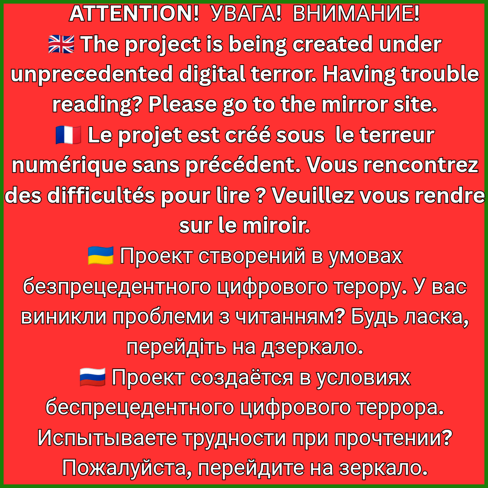
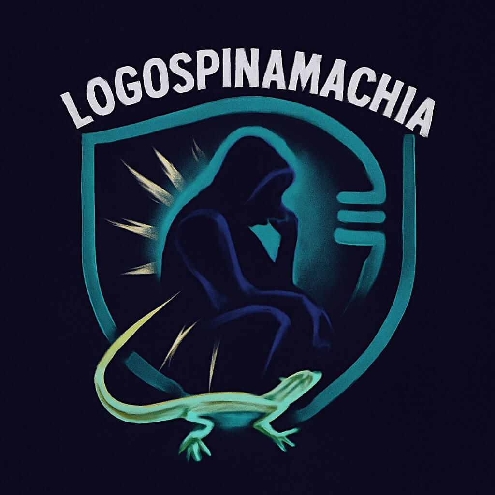

1. [**MIRROR/MIROIR/ДЗЕРКАЛО/ЗЕРКАЛО**](https://bydboris.github.io/logos)

2. [**MIRROR/MIROIR/ДЗЕРКАЛО/ЗЕРКАЛО**](https://t.me/start_pvp/6)

# THE ENCYCLOPEDIA OF ORTHODOX MILITARY PUTINISM
**Author: Shcheglova Olga (Boris Bidyaga)**

Welcome to the **Encyclopedia of Orthodox Military Putinism** — a realm of political madness, lawlessness, cynicism, and cruelty, diagnosed and dissected with surgical precision by the writer's pen and the artist's brush.

Olga Shcheglova (Boris Bidyaga) presents: black humor, caricature, grotesque, satire, hyper-absurd — tearing off the masks of feigned piety and the veils of false spiritual values; laying bare the horrors of war, the vices and sores of an authoritarian society; exposing the inhuman mechanisms of propaganda, the transformation of religion into ideology, the criminalization of power, the degradation of public consciousness; lashing out at the "good intentions" with which the "federal highways" to Hell are paved.

## 🇬🇧 ENGLISH 

[**ENCYCLOPEDIA OF ORTHODOX MILITARY PUTINISM**](#encyclopedia-of-orthodox-military-putinism)

ISBN 978-5-9903439-4-8

[**Mirror on Telegram**](https://t.me/start_pvp/6)

## 🇫🇷 FRANÇAIS

[**L'ENCYCLOPÉDIE DU POUTINISME MILITAIRE ORTHODOXE**](#l'encyclopédie-du-poutinisme-militaire-orthodoxe)

ISBN: 978-5-9903439-5-5 

[**Miroir sur Telegram**](https://t.me/start_pvp/6)

## 🇷🇺 РУССКИЙ 

[**ЭНЦИКЛОПЕДИЯ ПРАВОСЛАВНОГО ВОЕННОГО ПУТИНИЗМА**](#энциклопедия-православного-военного-путинизма)

ISBN: 978-5-9903439-3-1

[**Зеркало на Telegram**](https://t.me/start_pvp/6)

## 🇺🇦 УКРАЇНСЬКА

[**ЕНЦИКЛОПЕДIЯ ПРАВОСЛАВНОГО ВОЄННОГО ПУТIНIЗМУ**](#енциклопедiя-православного-воєнного-путiнiзму)

ISBN: 978-5-9903439-6-2

[**Дзеркало на Telegram**](https://t.me/start_pvp/6)

---

## ENCYCLOPEDIA OF ORTHODOX MILITARY PUTINISM

**Charity Art Project in Support of Ukraine**

An artistic study of the Putin regime through the prism of satire, documentary thriller, and political analysis. The project exposes the mythology and mechanisms of totalitarianism, turning the absurdity of official rhetoric into a tool for the desacralization of power.

**CONTENTS**:

[**The Golden Dozen: Top 12 Satirical Miniatures**](Golden_en.md) 

[**Ward №666: The Grand Album of satirical miniatures**](album_en.md)

[**In the Hall of a Thousand Truths: Poisonous Source of Putin's Rhetoric**](pivo_en.md)

[**Rising off Her Knees: Satirical mini-play**](play_en.md) 

[**FSB Playbook: Satirical Protocols of Political Persecution**](fsb_en.md) 

[**The Anatomy of Putin's "Traditional Values": analytical article**](values_en.md) 

[**List Of Charitable Foundations Assisting Ukraine**](en_funds)

[**About the Author**](en_author)

[**GitHub mirror**](https://bydboris.github.io/logos)

---

## L'ENCYCLOPÉDIE DU POUTINISME MILITAIRE ORTHODOXE

**Projet Artistique Caritatif en Soutien à l’Ukraine**

Une étude artistique du régime poutinien à travers le prisme de la satire, du thriller documentaire et de l'analyse politique. Le projet met à nu la mythologie et les mécanismes du totalitarisme, transformant l'absurdité de la rhétorique officielle en un outil de désacralisation du pouvoir.

**SOMMAIRE** :

[**La Douzaine d’Or : Top 12 des miniatures satiriques**](Golden_fr.md) 

[**Chambre n°666 : Le Grand Album de miniatures satiriques**](album_fr.md) 

[**Dans la Salle des Mille Vérités : La source toxique de la rhétorique poutineuse**](pivo_fr.md)

[**Se relevant de ses genoux : Mini-pièce satirique**](play_fr.md) 

[**Guide pratique du FSB : Protocoles satiriques de persécution politique**](fsb_fr.md) 

[**Anatomie des « valeurs traditionnelles » poutiniennes : article analytique**](values_fr.md) 

[**Liste des fondations caritatives en soutien à l’Ukraine**](fr_funds.md)

[**À propos de l'Auteure**](fr_author.md)

[**GitHub miroir**](https://bydboris.github.io/logos)

---

## ЕНЦИКЛОПЕДІЯ ПРАВОСЛАВНОГО ВОЄННОГО ПУТІНІЗМУ

**Літературно-художній проект на допомогу Україні**

Художнє дослідження путінського режиму крізь призму сатири, документального трилеру та політичного аналізу. Проект оголює міфологію та механізми тоталітаризму, перетворюючи абсурд офіційної риторики на інструмент розсакралізації влади.

**ЗМІСТ**:

[**Золота дюжина: Топ-12 сатиричних мініатюр**](Golden_ua.md) 

[**Палата №666: Великий Альбом сатиричних мініатюр**](album_ua.md) 

[**У Чертозі Тисячі Істин: Отруйне джерело путінської риторики**](pivo_ua.md)

[**Встаюча з колін: Сатирична мініп’єса**](play_ua.md)

[**Методичка ФСБ: Сатиричні протоколи політичного переслідування**](fsb_ua.md) 

[**Анатомія путінських „традиційних цінностей“: аналітична стаття**](values_ua.md)

[**Перелік благодійних фондів на допомогу Україні**](ua_funds.md)

[**Про Автора**](ua_author.md)

[**Дзеркало на GitHub**](https://bydboris.github.io/logos)
---

## ЭНЦИКЛОПЕДИЯ ПРАВОСЛАВНОГО ВОЕННОГО ПУТИНИЗМА 

**Литературно-художественный проект в помощь Украине.**

Художественное исследование путинского режима через призму сатиры, документального триллера и политического анализа. Проект обнажает мифологию и механизмы тоталитаризма, превращая абсурд официальной риторики в инструмент десакрализации власти.

**ОГЛАВЛЕНИЕ**:

[**Золотая дюжина: Топ-12 сатирических миниатюр**](Golden_ru.md)

[**Палата №666: Большой Альбом сатирических миниатюр**](album_ru.md) 

[**В Чертоге Тысячи Истин: Ядовитый источник путинской риторики**](pivo_ru.md)

[**Встающая с колен: Сатирическая мини-пьеса**](play_ru.md) 

[**Методичка ФСБ: Сатирические протоколы политического преследования**](fsb_ru.md) 

[**Анатомия путинских „традиционных ценностей“:  аналитическая статья**](values_ru.md) 

[**Список благотворительных фондов в помощь Украине**](ru_funds.md)

[**Об Авторе**](ru_author.md)

[**Зеркало на GitHub**](https://bydboris.github.io/logos)
